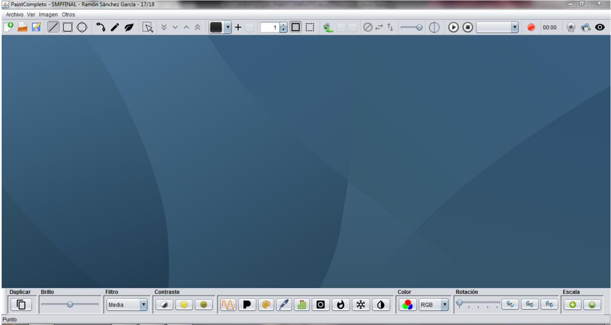

# multimediacenter

## Resumen

El objetivo de este proyecto ha sido el de aprender y trabajar con varios elementos del mundo **multimedia**. Entre ellos, he usado **gráficos** (para pintar figuras, como rectángulos, líneas o elipses, y sus correspondientes atributos), **imágenes** (manipulado su tamaño, brillo,  3 color, etc.), **sonido** y **video**. Para ello, he utilizado el lenguaje de programación Java, y varias de sus bibliotecas que nos han permitido jugar con estos elementos, y crear una especie de *Paint* multimedia, como el de *Windows*. Dicho *Paint* nos ha permitido realizar acciones de pintado, manipular imagen, audio y sonidos. La propia implementación de este programa ha sido a través de **Java.** Para poder implementar y utilizar estas acciones, he aprendido también a implementar la interfaz correspondiente del programa, la cual se ha hecho gracias a la biblioteca que ofrece este lenguaje: **Java Swing**. Gracias a ella hemos implementado botones, entre otros elementos. 

Y si hablo de botones, he de hablar de otra de las cosas más importantes que hemos aprendido en el curso, que son los eventos, los cuales se activan cuando se produce una acción en nuestra aplicación y estará ligado a una serie de acciones que se tomarán cuando se produzcan estos eventos. Aunque nuestro entorno de desarrollo ofrece algunos por defecto, hemos visto que no siempre vamos a tener eventos con sus Listeners disponibles, por lo que tendremos que ser nosotros quienes lo implementemos.

He utilizado el [IDE Netbeans](https://netbeans.org/) para trabajar durante toda la asignatura y realizar nuestra aplicación. Me ha permitido trabajar cómodamente con una interfaz gráfica que me permitió añadir cómodamente elementos *Swing* a mi aplicación, entre otras cosas. El aspecto de mi aplicación final es el siguiente: 

Se distinguen varios elementos *Swing*, como botones, deslizadores, menús desplegables, etc. Además recoge acciones de los cuatro bloques con los que hemos trabajado a lo largo del cuatrimestre. Las acciones que permite mi aplicación son las siguientes: 

* Abrir, crear o guardar una imagen. 
* Abrir audio, reproducirlo e incluso grabar un nuevo audio. 
* Abrir video y webcam, de los cuales puedo tomar capturas de pantalla y, en el caso de la webcam, activar un sistema de vigilancia que hará capturas en caso que detecte movimiento. 
* Modificar el tamaño o escalar dicha imagen o lienzo de la imagen. 
* Pintar una de las figuras disponibles. 
* Mover una figura pintada, ya sea por el lienzo, como su posición respecto a las otras del lienzo (detrás o delante del resto de figuras). 
* Cambiar el atributo de la figura seleccionada o pintar una con los atributos seleccionados. 
* Duplicar una imagen. 
* Aplicar a una imagen diversos filtros programados. 
* Rotar la imagen. 
* Escalar la imagen. 
* Obtener sus bandas, dependiendo del tipo de espacio de colores que tenga dicha imagen. Para poder hacer todo esto posible, he utilizado todo lo que Java me ofrece. Sin embargo, como hemos visto a lo largo de la asignatura, las bibliotecas que ofrece *Java*, los métodos y demás, no son del todo correctos: les falta personalización. Y este ha sido otro de los objetivos de esa aplicación, el ofrecer nosotros clases propias que permitan realizar dicha personalización. 

Mi aplicación se divide en los siguientes elementos: 

* **Ventana Principal:** Será la que albergue todo lo relacionado con los botones, deslizadores y demás elementos swing. Para dibujar alguna figura o trabajar sobre una imagen, se encargará de abrir Ventanas Internas, de diferente tipo. 
* **Ventana Interna SM:** Las Ventanas Internas que albergarán el lienzo donde pintaremos, la imagen que queremos editar, el video o incluso la webcam. Dichos tipos de *Ventana Interna* son clases hijas de este elemento: o *Ventana Interna Imagen: Lienzo e Imagen.* 
* **Tendrá un atributo Lienzo2D con la información de los atributos del lienzo actual y/o de la figura seleccionada. o Ventana Interna Video:** hay de dos tipos, la VLC y la JMF. Aunque están ambas implementadas, la aplicación usa la primera. o Ventana Interna Webcam. 
* **Ventanas de Dialogo**. Hay dos, una primera asignada a la ventana de imagen, para cambiar el tamaño de dicho lienzo que se muestra en esta ventana interna; una segunda ventana de dialogo que se llama al pulsar el botón “*Sobre el programa…*” en el menú “*Otros*”.

## Material 

En este repositorio se ofrece el siguiente material:

* Código fuente de la aplicación
* Imágenes, sonidos y videos de muestra, para la manipulación de estos con el programa
* [Documentación del proyecto](documentacion.pdf) y del propio código, generada mediante javadocs. 